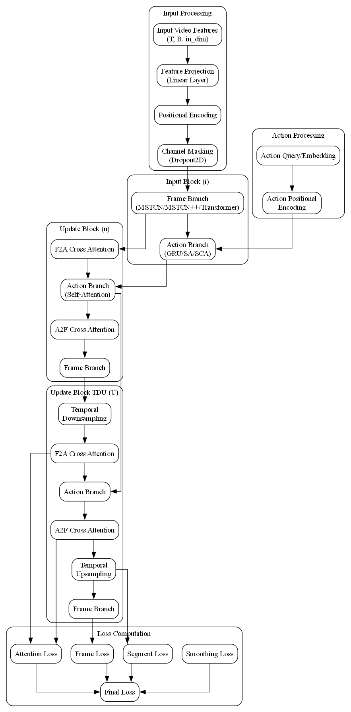
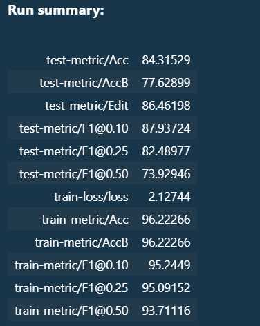

# FAFormer

A PyTorch implementation of temporal action segmentation model that couples frame features with action tokens through multi-stage attention mechanisms.

## Table of Contents
- [Overview](#overview)
- [Model Architecture](#model-architecture)
- [Project Structure](#project-structure)
- [Results](#results)

## Overview

FAFormer is a novel architecture for temporal action segmentation that:
- Processes video features and action tokens in parallel
- Uses multi-stage attention for feature-action coupling
- Employs temporal downsampling and upsampling for efficient processing
- Uses ASFormer Backbone for Frame Branch

## Model Architecture

The model consists of three main types of blocks:

1. **Input Block (i)**:
   - Initial processing of frame features
   - Action token initialization
   - Basic feature-action coupling

2. **Update Block (u)**:
   - Cross-attention between frames and actions
   - Self-attention for action refinement
   - Feature updates through attention

3. **Update Block with TDU (U)**:
   - Temporal downsampling of frame features
   - Segment-level attention
   - Temporal upsampling for final predictions
   


## Project Structure

```
fact/
├── configs/              # Configuration files
│   ├── default.py       # Default configuration
│   └── gtea3.yaml       # Dataset specific config
├── models_faformer/     # Model implementation
│   ├── __init__.py
│   ├── attention.py     # Attention mechanisms
│   ├── base_block.py    # Base block definition
│   ├── fact.py         # Main FACT model
│   └── layers.py       # Neural network layers
├── utils/              # Utility functions
│   ├── dataset.py      # Data loading and processing
│   ├── evaluate.py     # Evaluation metrics
│   └── train_tools.py  # Training helpers
├── train_gtea.ipynb    # Training notebook
```


## Results

Model performance on benchmark datasets:



## References

- I3D: Carreira, J. and Zisserman, A. "Quo Vadis, Action Recognition? A New Model and the Kinetics Dataset." CVPR 2017.

- ASFormer: Yi, Y. et al. "ASFormer: Transformer for Action Segmentation." BMVC 2021.

- FACT: Chen, L. et al. "FACT: A Framework for Fast Action Segmentation with Token Learners." ICCV 2023.


